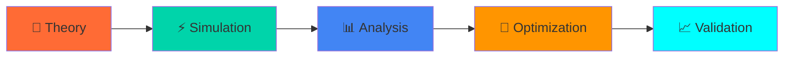

<div align="center">

# ⚡ ANALOG CIRCUIT NEXUS ⚡
### 🔬 *Next-Gen OpAmp Design & ML-Driven Analysis* 🔬


[](https://github.com)
[](https://github.com)
[](https://github.com)
[](https://github.com)

</div>

---

## 🚀 **MISSION CONTROL** 

> *Where analog meets digital intelligence - pushing the boundaries of operational amplifier design through systematic engineering and data-driven optimization*

### 🔥 **PHASE I: NEURAL FOUNDATION**
```
🧠 DIFFERENTIAL CORE ANALYSIS
├── 🔬 Multi-section NMOS differential pairs
├── ⚙️  Theoretical validation & operating point mapping  
└── 📈 Performance characterization across circuit domains
```

### ⚡ **PHASE II: FUSION ARCHITECTURE**
```
🚀 COMPLETE AMPLIFIER SYNTHESIS  
├── 🔗 Integrated multi-stage design
├── 💪 Push-pull complementary output stage
└── 🎯 Advanced load analysis & optimization
```

---

## 🛠️ **TECH ARSENAL**

<div align="center">

| 🔧 **Component** | 🎯 **Specification** | 🚀 **Performance** |
|:---:|:---:|:---:|
| ⚡ **Power Rails** | `±10V Supply` | `Ultra-Low Noise` |
| 🔬 **NMOS Core** | `W=100μ, L=1μ` | `High-Speed Response` |
| 🎛️ **Bipolar Stage** | `2N3904/2N3906` | `Linear Operation` |
| 🔄 **Current Mirror** | `1-2mA Bias` | `Precision Matching` |
| 🎯 **Load Target** | `100Ω Standard` | `Optimized Drive` |

</div>

---

## 📁 **NEURAL NETWORK STRUCTURE**

```
🌐 ANALOG-CIRCUIT-NEXUS/
├── 🔬 phase1/                    # Foundation Layer
│   ├── ⚡ LTspice_simfiles/      # Raw neural data
│   ├── 📊 simulation_report.pdf  # Phase I intelligence
│   └── 🧠 theory_analysis.pdf    # Theoretical framework
├── 🚀 phase2/                    # Evolution Layer  
│   ├── 🔬 Analysis_part1.asc     # Complete synthesis
│   ├── ⚡ Design_part2.asc       # Final architecture
│   ├── 💪 Outputstage.asc        # Power delivery
│   └── 📈 report.pdf             # Performance matrix
```

---

## 🎯 **CORE CAPABILITIES**

<div align="center">

### 🔥 **ENGINEERING EXCELLENCE**
🧠 **Multi-Stage Intelligence** • 📊 **Data-Driven Optimization** • ⚡ **Real-Time Simulation**

### 🚀 **PERFORMANCE METRICS**
📈 **Differential Gain Analysis** • 🎯 **CMRR Optimization** • 💪 **Output Stage Efficiency**

### 🔬 **ADVANCED ANALYTICS**  
📊 **Frequency Response Mapping** • ⚙️ **Load Regulation Analysis** • 🎛️ **Transient Behavior**

</div>

---

## 🌟 **SIMULATION INTELLIGENCE**

```python
# Performance Matrix
differential_gain = "High-precision amplification"
cmrr_performance = "Superior common-mode rejection" 
output_linearity = "Optimized efficiency curves"
frequency_response = "Broadband characterization"
load_regulation = "Adaptive drive capabilities"
```

---

## ⚡ **ENGINEERING METHODOLOGY**

<div align="center">



</div>

---

<div align="center">

### 🔥 **PASSION-DRIVEN ENGINEERING** 🔥
*Bridging analog precision with digital intelligence*

[](https://github.com)
[](https://github.com)
[](https://github.com)

**🚀 *Where circuits meet code, and data drives design* 🚀**

</div>
